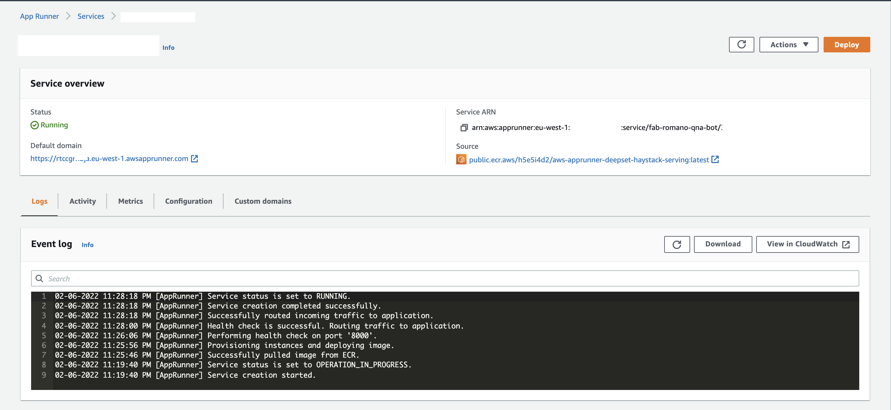

# NLP Model Serving with Haystack and FastAPI on AWS App Runner

In this example, we will make use of the new AWS AppRunner managed container service
to deploy an NLP model inference service. This service uses [deepset's](https://www.deepset.ai/) 
[haystack](https://github.com/deepset-ai/haystack) for a simple Q&A application and a REST API. 
Anyone with interests in [football transfers](https://www.transfermarkt.com/)
can make use of the simple Q&A application.


## The Problem
To stay updated with the latest news on football transfers, I noticed that I spend a lot 
scrolling through tons of tweets to stay updated. Football transfer news are part of the 
excitement in Football -- fans want to know which players are joining or leaving. As a fan,
I also like to follow how footballer transfer discussions develop in the course of the transfer
window.

As a result of the disatisfaction scrolling through enless tweets, I decided to build this simple
service that helps collect transfer news tweets and I simply ask it questions. Hence, I don't have 
follow as many journalists or expend valuable time scrolling through Twitter.  


## The Tech Stack
**Containers Everywhere!** 

This application runs on [AWS App Runner](https://aws.amazon.com/apprunner/). 
[AWS App Runner](https://aws.amazon.com/apprunner/) is a fully managed service that makes it easy 
for developers to quickly deploy containerized web applications and APIs, at scale and 
with no prior infrastructure experience required. I didn't
want to be bothered with optimizing Docker images for AWS Lambda, after which I would have to add 
Amazon APi Gateway and some static hosting on Amazon S3. With AWS App Runner, the entire application
is built into one Docker container, the web application and the REST API.


**Natural Language Understanding** 

To ensure that questions are answered intelligently, I make use [deepset](https://www.deepset.ai/) 's 
[Haystack NLP framework](https://github.com/deepset-ai/haystack) for powering Question Answering.

**REST API**

This runs on [FastAPI](https://fastapi.tiangolo.com/), a modern, fast (high-performance), web framework 
for building APIs with Python 3.6+ based on standard Python type hints.

The entire infrastructure is provisioned via AWS CloudFormation and the Docker image is available
on AWS ECR Public.


## Data Work
The dataset on which the context for answering questions are tweets 
from [Fabrizio Romano](https://twitter.com/FabrizioRomano), the most up-to-date/reliable sports journalist when 
it comes to football transfers news. Fabrizio is popular for breaking successfully completed 
football transfer deals with his tagline: `Here we go !`. The tweets were scraped using the
tweepy Python library to collect all Fabrizio's tweets dating as far back as 2011.

### Data Preparation
[Haystack NLP framework](https://github.com/deepset-ai/haystack) requires context be provided as 
documents indexed into a document store. Supported document stores include Elasticsearch, InMemory, SQL,
and FAISS. Haystack recommends using Elasticsearch, but we will stick with the InMemoryDocumentStore which can
be instantiated using the snipped below:

```python
from haystack.document_stores import InMemoryDocumentStore

document_store = InMemoryDocumentStore()
```  

### Data Preparation
Using the Twitter API, we collect tweets from [Fabrizio Romano](https://twitter.com/FabrizioRomano) and 
format as a list of dictionaries. The format below shows as an example of the dictionaries:

```python
{"name": "", "text": "<complete-tweet-text-here>"}
```
 
With the tweets in place, the next step is to index the data into the Haystack `InMemoryDocumentStore`.
This is done with the line below:

```python
dicts = [{"name": "", "text": "<complete-tweet-text-here>"}, {"name": "", "text": "<complete-tweet-text-here>"}, ...]
document_store.write_documents(dicts)
``` 

Because we do not want to reindex our tweets on every user request, we will save the `document_store`
 object as a pickle file and load this at deployment and runtime. This approach is 
 similar to retrieving trained machine learning models from pickle objects.
 
### Deployment
For a simplified deployment, the entire application is packaged as a [docker image](https://gallery.ecr.aws/h5e5i4d2/aws-apprunner-deepset-haystack-serving)
 hosted on
[Amazon ECR Public Gallery](https://gallery.ecr.aws/), deployed to AWS App Runner 
via AWS CloudFormation, and automated by a simple bash script. 

See the CloudFormation template below:

```yaml
...
Resources:
  HFModelServingService:
    Type: AWS::AppRunner::Service
    Properties:
      ServiceName: fab-romano-qna-bot
      SourceConfiguration:
        AutoDeploymentsEnabled: false
        ImageRepository:
          ImageIdentifier: !Ref PublicECRIdentifier
          ImageRepositoryType: !Ref ECRType
          ImageConfiguration:
            Port: 8000
      InstanceConfiguration:
        Cpu: 2 vCPU
        Memory: 4 GB
...
```

On successful deployment to AWS App Runner, the service was immediately available and accessible.
No server or clusters to maintain and at the same time, zero cold-start issues. 




# Future Work
I hope to see this evolve into usable product for football fans like me all over the world
to follow transfer updates without their valuable time scrolling through Twitter or constant
Twitter refreshes. Solving this problem for myself, I would add a feature that would send
me instant alerts when a question has new answers and automatically disable the notification
once the transfer deal is successful or falls through.

From the developer experience, AWS App Runner truly simplifies working with containers. If my 
application needs to store any information, this can easily be done by adding a 
[Serverless SimpleTable](https://docs.aws.amazon.com/serverless-application-model/latest/developerguide/sam-resource-simpletable.html)
 with AWS SAM. I can easily imagine AWS App Runner being added to 
 [AWS Serverless Application Model]() to simplify container deployment for builders:
 
```yaml
Type: AWS::Serverless::SimpleContainer
Properties:
    ServiceName: String
    SourceConfiguration: SourceConfigurationObject
    Cpu: String
    Memory: String
    Role: String
    Policies: PolicyObject
```

