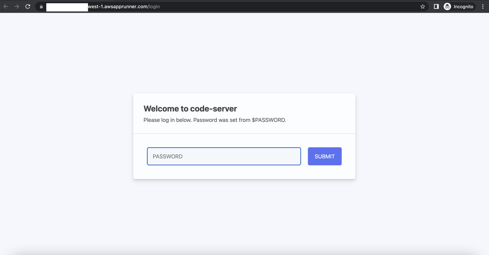
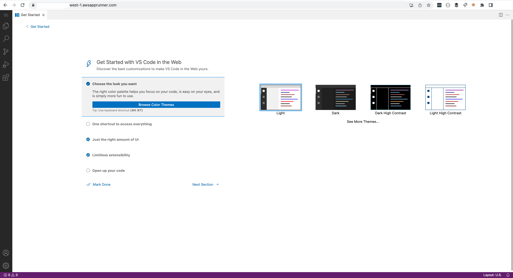

# VS Code Server on AWS AppRunner

In this, I will walk through how I deployed [VS Code Server](https://github.com/linuxserver/docker-code-server) on 
[AWS App Runner](https://aws.amazon.com/apprunner/) to solve a problem close to heart.


## The Problem

I recently witnessed my wife complain about the delay to setup a development environment on her work tool during an internship. 
Furthermore, a number of my family members, without technical backgrounds, are enrolling for Masters degree in technology programs, 
and one of the first questions I receive is:
> _How do I setup my computer? What software do I need to install? What is VS Code? What is Jupyter?_

**The most comical of the questions are:**
> Why did we spend so much on you to study Computer Science and you cannot explain these simple things? 
> or Are you not doing something for AWS, why should this be so difficult?

I could easily host a Zoom call and run screen sharing sessions to demonstrate this. 
But we all know this approach does not work; biggest learning onboarding new colleagues remotely.

## The Solution
Thinking about the job my family members want to get done, they really do not care about installing and debugging development environments. 
All they want is environment that enables succeed at their academics and not to become software engineers. 

Before building anything, I ran the "**Wife Test**" on my idea:
> I'm working on something that will allow your sister, my sister, and any other family member who is delving into tech 
> get started with a development environment as simple as logging into their Facebook account. Does it make sense and will you use it?

Once I received a green light, it was high time I hacked the technology together in the leanest possible 
way (eliminating as much waste as possible). This meant that I did not want to create any servers or clusters. 
All I needed was a simplest possible technical implementation that helped me learn if I was solving the problem right 
for my kinsmen new to the technology space.


## The Tech Stack
Having discovered how simple it was to deploy containerized applications on [AWS App Runner](https://aws.amazon.com/apprunner/), I did not look any further. 
The journey started with a simple Dockerfile using the [linuxserver/code-server](https://github.com/linuxserver/docker-code-server) as the base image, 
prebaked with some Python libraries for analytics: jupyter, pandas, numpy, awswrangler, [etc](./requirements.txt).

[Dockerfile](./Dockerfile)
```dockerfile
FROM linuxserver/code-server:latest

USER root
RUN apt-get update && \
    apt-get install -y sqlite3 && \
    apt-get install -y software-properties-common && \
    add-apt-repository ppa:deadsnakes/ppa && \
    apt-get update && \
    apt-get install -y python3.8 python3-pip s3fs && \
    rm -rf /var/lib/apt/lists

COPY requirements.txt /
RUN pip install -r /requirements.txt

RUN ln -s /usr/bin/python3 /usr/bin/python && \
    mkdir -p /config/workspace/evelyn/ /config/workspace/omolara/ /config/workspace/lekan/
ENV PATH="${PATH}:/config/.local/bin"

## Set the directory where you want to mount your s3 bucket
ARG S3_MOUNT_DIRECTORY=/config/workspace
ENV S3_MOUNT_DIRECTORY=$S3_MOUNT_DIRECTORY

EXPOSE 8443

## Entry Point
ADD s3-docker-mount-script.sh /s3-docker-mount-script.sh
RUN chmod 755 /s3-docker-mount-script.sh
CMD ["/s3-docker-mount-script.sh"]
```

I mounted the workspace directory on Amazon S3 with s3fs, as a means for persistent storage. The last thing you want is non-tech folks 
logging into their remote work station with all their previous work disappeared. Why not [Amazon Elastic File System](https://aws.amazon.com/efs/)? 
As I said, I needed to put together [minimum viable architecture](https://www.infoq.com/articles/minimum-viable-architecture/). 
Also, [Amazon EFS](https://aws.amazon.com/efs/) is not yet supported on AWS AppRunner at this time of this writing.

## Deployment
[VS Code Server]((https://github.com/linuxserver/docker-code-server)) was deployed on [AWS App Runner](https://aws.amazon.com/apprunner/)
 with [AWS CloudFormation](https://aws.amazon.com/cloudformation/). See example CloudFormation resource below:
```yaml
Resources:
...
 VSCodeServerService:
  Type: AWS::AppRunner::Service
  Properties:
    ServiceName: vs-code-server
    SourceConfiguration:
      AutoDeploymentsEnabled: false
      ImageRepository:
        ImageIdentifier: !Ref PublicECRIdentifier
        ImageRepositoryType: !Ref ECRType
        ImageConfiguration:
          Port: 8443
          RuntimeEnvironmentVariables:
            - Name: TZ
              Value: Europe/Berlin
            - Name: PUID
              Value: 1000
            - Name: PGID
              Value: 1000
            - Name: PASSWORD
              Value: !Ref VSCodePassword
            - Name: S3_BUCKET_NAME
              Value: !Ref S3Bucket
    InstanceConfiguration:
      Cpu: 2 vCPU
      Memory: 4 GB
...
```

On successful stack creation, the container URL is available from AWS AppRunner, 
which is then shared with family members along with the password:






---

With this simple solution built with AWS AppRunner, my family members venturing into tech, who are not software engineers, 
are able to get started on their work easily. Maybe I get to charge them $9/person/month to cover the infrastructure costs.

